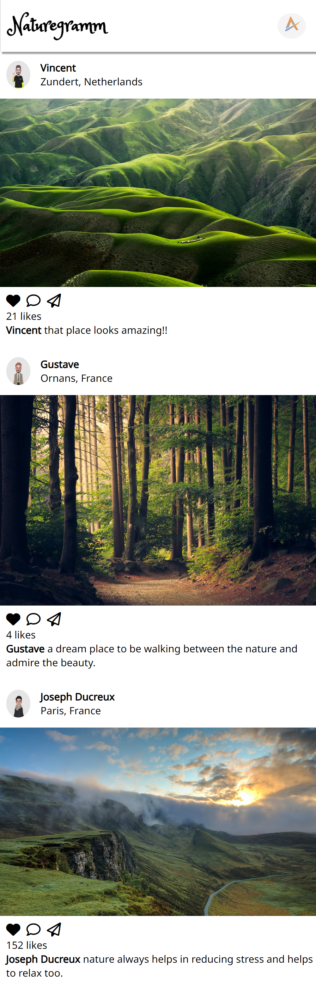

# Naturegramm
 
 ## Table of Content

 * [Overview of the Project](#overview-of-the-project)
      * [Screenshot](#screenshot)
 * [Technologies I Used](#technologies-i-used)
 * [What I Learned](#what-i-learned) 
 
# Overview of the Project

Naturegramm is a collection of wide variety of photos of nature. I have added the feature to like a particular photo when double clicked and render all the images which is to be shown.

## Screenshot

## Technologies I Used
* Semantic HTML5
* CSS
* Vanilla Javascript

## What I Learned

- Learned how to pass data using forEach.
- Learned about data attributes.
- Learned how to conditionally render styles in JS.
